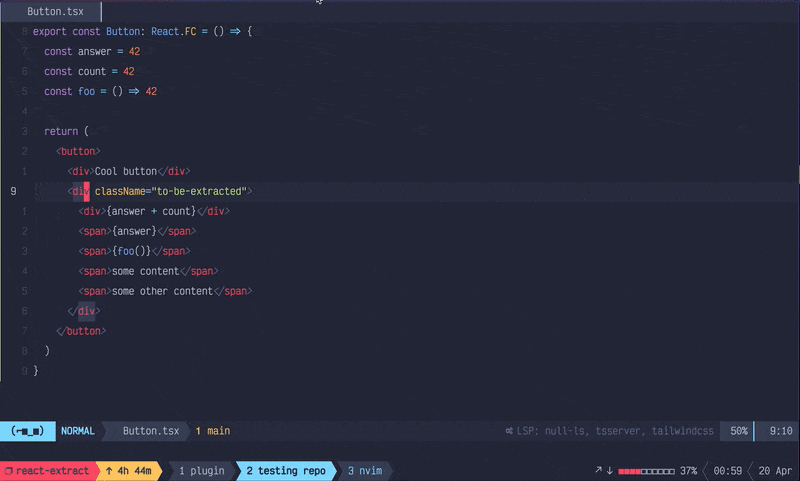

# react-extract.nvim

Neovim plugin for extracting JSX into a new React component.

**Requires Neovim >= 0.7**



## :sparkles: Features
  - distinction between JS and TS files
  - configurable component templates for JS / TS
  - preserves correct indentation
  - autoimport of the new component (using Neovim's built-in LSP and `tsserver`)
  - identifiers in extracted code are passed as props to the new component
    (requires `nvim-treesitter`)
  - easily configurable

## :computer: Installation

Use your preferred plugin manager, e.g. [vim-plug](https://github.com/junegunn/vim-plug "vim-plug").

```lua
Plug "napmn/react-extract.nvim"
```

It is recommended to have [treesitter](https://github.com/nvim-treesitter/nvim-treesitter "treesitter")
and `tsserver` for Neovim's built-in LSP installed to support all available features.

## :wrench: Setup and configuration

Run `setup` function in your *init.lua* file:

```lua
require("react-extract").setup()
```

Optionally you can provide a table of options to override the defaults:

```lua
-- Using setup function with default values
require("react-extract").setup({
  ts_type_property_template = "[INDENT][PROPERTY]: any\n",
  ts_template_before =
    "type [COMPONENT_NAME]Props = {\n[TYPE_PROPERTIES]}\n[EMPTY_LINE]\n"
    .. "export const [COMPONENT_NAME]: React.FC<[COMPONENT_NAME]Props> = "
    .. "([PROPERTIES]) => {\n"
    .. "[INDENT]return (\n",
  ts_template_after = "[INDENT])\n}",
  js_template_before =
    "export const [COMPONENT_NAME] = "
    .. "([PROPERTIES]) => {\n"
    .. "[INDENT]return (\n",
  js_template_after = "[INDENT])\n}",
  use_autoimport = true,
  autoimport_defer_ms = 350
})
```

You can read more about available options and their meaning in the [docs](doc/react-extract.txt "docs").


## :scissors: Usage

Map `extract_to_new_file` function to your preferred mapping, e.g.:

```lua
vim.keymap.set({ "v" }, "<Leader>re", require("react-extract").extract_to_new_file)
```

For extracting first select part of JSX that you want to extract. Recommended way
is using visual line mode. :warning:&nbsp;Indent inconsistencies can occur while using visual character
mode.&nbsp;:warning:

Then use your mapped key, enter path where the new component should be created and that's it!

## :octocat: Contributing

All PRs / Issues with possible enhancements or found bugs are welcomed and appreciated.

## :construction: TODO

- [ ] extract component to current file
- [ ] infer type from original identifiers if possible

